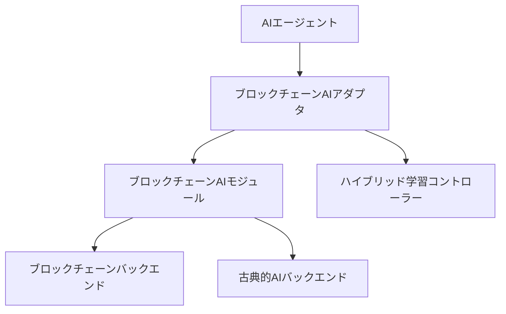
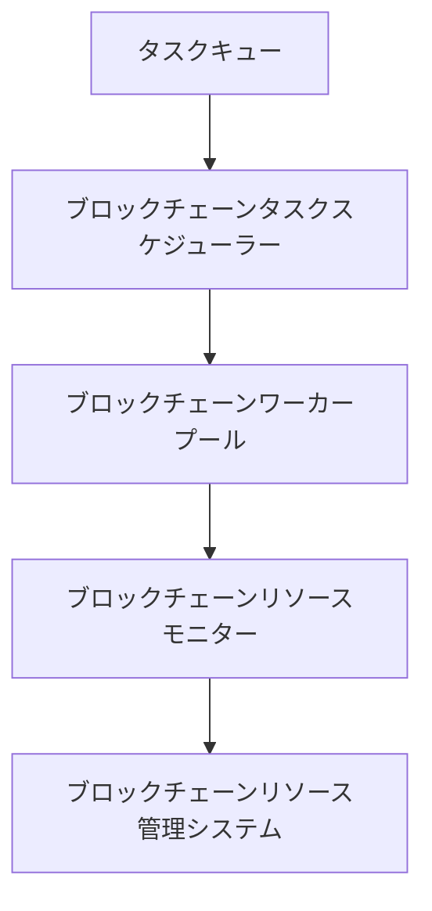

# 次世代ブロックチェーンAI統合設計

## 概要

このドキュメントは、次世代ブロックチェーンAI統合の設計仕様を定義します。ブロックチェーン技術とAIエージェントの統合強化、分散型AI処理の最適化、ブロックチェーンアルゴリズムの実用化研究を目指します。

## 目標

1. **ブロックチェーン技術とAIエージェントの統合強化**
   - ブロックチェーンAIモジュールの設計と実装
   - AIエージェントとのインターフェース定義
   - ハイブリッドブロックチェーンAIアルゴリズムの開発

2. **分散型AI処理の最適化**
   - 分散型AI処理フレームワークの設計
   - ブロックチェーンタスクスケジューリングアルゴリズムの実装
   - ブロックチェーンリソース管理システムの開発

3. **ブロックチェーンアルゴリズムの実用化研究**
   - ブロックチェーンアルゴリズムの実用化評価
   - ブロックチェーンアルゴリズムのパフォーマンス最適化
   - 実世界データでの検証

## アーキテクチャ

### ブロックチェーンAIモジュール

### 分散型AI処理フレームワーク

## 実装計画

### フェーズ1: ブロックチェーンAIモジュールの設計

1. **ブロックチェーンAIの基本アーキテクチャ設計**
   - ブロックチェーンスマートコントラクトと古典的AIのインターフェース設計
   - ハイブリッドブロックチェーンAIアルゴリズムの設計
   - ブロックチェーンAIモジュールのAPI設計

2. **AIエージェントとのインターフェース定義**
   - ブロックチェーンAIモジュールのAPI設計
   - エージェント統合のためのアダプタ開発
   - インターフェースのドキュメント作成

### フェーズ2: 分散型AI処理フレームワークの設計

1. **分散型AI処理フレームワークの設計**
   - ブロックチェーンタスクスケジューリングアルゴリズムの設計
   - ブロックチェーンリソース管理システムの設計
   - 分散型AI処理のAPI設計

2. **ブロックチェーンリソース管理システムの開発**
   - ブロックチェーンリソースモニタリング機能の実装
   - 動的リソース割り当てアルゴリズムの実装
   - ブロックチェーンリソース管理のAPI設計

### フェーズ3: ブロックチェーンアルゴリズムの実用化研究

1. **ブロックチェーンアルゴリズムの選定と適応**
   - ブロックチェーンアルゴリズムの選定
   - 実用化のための最適化
   - ブロックチェーンアルゴリズムの統合テスト

2. **実世界データでの検証**
   - 実世界データセットの準備
   - ブロックチェーンアルゴリズムのパフォーマンス評価
   - ブロックチェーンアルゴリズムのドキュメント作成

## テスト計画

### 統合テスト

1. **ブロックチェーンAIモジュールの統合テスト**
   - 基本的な統合テストケースの設計
   - エラーハンドリングテストケースの設計
   - パフォーマンスベンチマークテストケースの設計

2. **分散型AI処理フレームワークの統合テスト**
   - ブロックチェーンタスクスケジューリングの統合テスト
   - ブロックチェーンリソース管理の統合テスト
   - 分散型AI処理の統合テスト

### パフォーマンスベンチマーク

1. **ブロックチェーンAIモジュールのパフォーマンスベンチマーク**
   - パフォーマンスベンチマークコードの作成
   - ベンチマークの実行
   - ベンチマーク結果の分析

2. **分散型AI処理フレームワークのパフォーマンスベンチマーク**
   - ブロックチェーンタスクスケジューリングのパフォーマンス評価
   - ブロックチェーンリソース管理のパフォーマンス評価
   - 分散型AI処理のパフォーマンス評価

## ドキュメント

1. **APIドキュメント**
   - ブロックチェーンAIモジュールのAPIドキュメント
   - 分散型AI処理フレームワークのAPIドキュメント
   - ブロックチェーンアルゴリズムのAPIドキュメント

2. **ユーザーガイド**
   - ブロックチェーンAIモジュールの使用ガイド
   - 分散型AI処理フレームワークの使用ガイド
   - ブロックチェーンアルゴリズムの使用ガイド

3. **技術仕様書**
   - ブロックチェーンAIモジュールの技術仕様
   - 分散型AI処理フレームワークの技術仕様
   - ブロックチェーンアルゴリズムの技術仕様

## 次のステップ

1. ブロックチェーンAIモジュールの設計を開始
2. 分散型AI処理フレームワークの設計を開始
3. ブロックチェーンアルゴリズムの実用化研究を開始
4. 統合テストとパフォーマンスベンチマークを実施
5. ドキュメントを作成

**プロジェクトは次世代ブロックチェーンAI統合の設計フェーズに移行し、ブロックチェーン技術とAIエージェントの統合強化を目指します！** 🚀