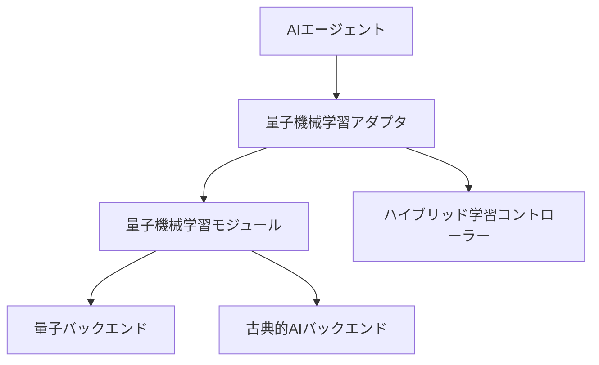
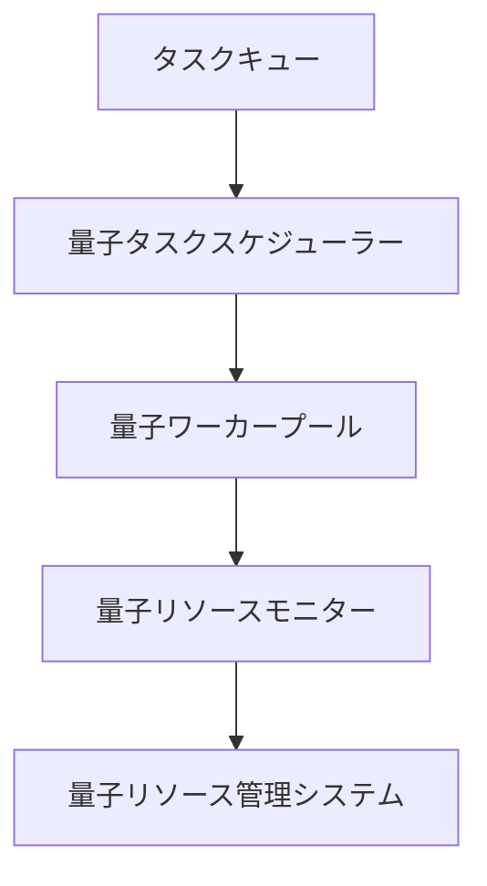

# 次世代量子AI統合設計

## 概要

このドキュメントは、次世代量子AI統合の設計仕様を定義します。量子機械学習とAIエージェントの統合強化、量子並列処理の最適化、量子アルゴリズムの実用化研究を目指します。

## 目標

1. **量子機械学習とAIエージェントの統合強化**
   - 量子機械学習モジュールの設計と実装
   - AIエージェントとのインターフェース定義
   - ハイブリッド量子古典アルゴリズムの開発

2. **量子並列処理の最適化**
   - 量子並列処理フレームワークの設計
   - 量子タスクスケジューリングアルゴリズムの実装
   - 量子リソース管理システムの開発

3. **量子アルゴリズムの実用化研究**
   - 量子アルゴリズムの実用化評価
   - 量子アルゴリズムのパフォーマンス最適化
   - 実世界データでの検証

## アーキテクチャ

### 量子機械学習モジュール

### 量子並列処理フレームワーク

## 実装計画

### フェーズ1: 量子機械学習モジュールの設計

1. **量子機械学習の基本アーキテクチャ設計**
   - 量子回路と古典的AIのインターフェース設計
   - ハイブリッド量子古典アルゴリズムの設計
   - 量子機械学習モジュールのAPI設計

2. **AIエージェントとのインターフェース定義**
   - 量子機械学習モジュールのAPI設計
   - エージェント統合のためのアダプタ開発
   - インターフェースのドキュメント作成

### フェーズ2: 量子並列処理フレームワークの設計

1. **量子並列処理フレームワークの設計**
   - 量子タスクスケジューリングアルゴリズムの設計
   - 量子リソース管理システムの設計
   - 量子並列処理のAPI設計

2. **量子リソース管理システムの開発**
   - 量子リソースモニタリング機能の実装
   - 動的リソース割り当てアルゴリズムの実装
   - 量子リソース管理のAPI設計

### フェーズ3: 量子アルゴリズムの実用化研究

1. **量子アルゴリズムの選定と適応**
   - 量子アルゴリズムの選定
   - 実用化のための最適化
   - 量子アルゴリズムの統合テスト

2. **実世界データでの検証**
   - 実世界データセットの準備
   - 量子アルゴリズムのパフォーマンス評価
   - 量子アルゴリズムのドキュメント作成

## テスト計画

### 統合テスト

1. **量子機械学習モジュールの統合テスト**
   - 基本的な統合テストケースの設計
   - エラーハンドリングテストケースの設計
   - パフォーマンスベンチマークテストケースの設計

2. **量子並列処理フレームワークの統合テスト**
   - 量子タスクスケジューリングの統合テスト
   - 量子リソース管理の統合テスト
   - 量子並列処理の統合テスト

### パフォーマンスベンチマーク

1. **量子機械学習モジュールのパフォーマンスベンチマーク**
   - パフォーマンスベンチマークコードの作成
   - ベンチマークの実行
   - ベンチマーク結果の分析

2. **量子並列処理フレームワークのパフォーマンスベンチマーク**
   - 量子タスクスケジューリングのパフォーマンス評価
   - 量子リソース管理のパフォーマンス評価
   - 量子並列処理のパフォーマンス評価

## ドキュメント

1. **APIドキュメント**
   - 量子機械学習モジュールのAPIドキュメント
   - 量子並列処理フレームワークのAPIドキュメント
   - 量子アルゴリズムのAPIドキュメント

2. **ユーザーガイド**
   - 量子機械学習モジュールの使用ガイド
   - 量子並列処理フレームワークの使用ガイド
   - 量子アルゴリズムの使用ガイド

3. **技術仕様書**
   - 量子機械学習モジュールの技術仕様
   - 量子並列処理フレームワークの技術仕様
   - 量子アルゴリズムの技術仕様

## 次のステップ

1. 量子機械学習モジュールの設計を開始
2. 量子並列処理フレームワークの設計を開始
3. 量子アルゴリズムの実用化研究を開始
4. 統合テストとパフォーマンスベンチマークを実施
5. ドキュメントを作成

**プロジェクトは次世代量子AI統合の設計フェーズに移行し、量子機械学習とAIエージェントの統合強化を目指します！** 🚀