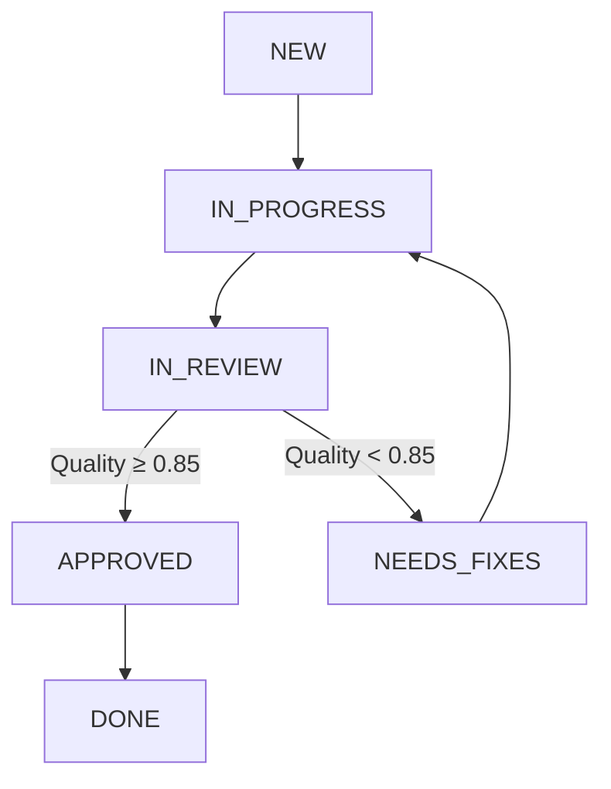

# ステップバイステップガイド：高度なフィードバックループワークフロー

このガイドでは、高度なフィードバックループワークフローを詳細に説明し、各ステップを案内します。

## 目次

1. [はじめに](#introduction)
2. [ワークフローの概要](#workflow-overview)
3. [ステップ1：要件収集](#step-1-requirements-gathering)
4. [ステップ2：開発計画](#step-2-development-planning)
5. [ステップ3：API設計](#step-3-api-design)
6. [ステップ4：並列開発](#step-4-parallel-development)
7. [ステップ5：コードレビュー](#step-5-code-reviews)
8. [ステップ6：品質監査](#step-6-quality-audit)
9. [ステップ7：要件監査](#step-7-requirements-audit)
10. [ステップ8：テスト](#step-8-testing)
11. [ステップ9：統合](#step-9-integration)
12. [フィードバックループのメカニズム](#feedback-loop-mechanics)
13. [エラーハンドリング](#error-handling)
14. [パフォーマンス最適化](#performance-optimization)
15. [トラブルシューティング](#troubleshooting)

## はじめに

高度なフィードバックループワークフローは、反復的な改善サイクルを通じて高品質なソフトウェア開発を保証するように設計されています。このガイドでは、ワークフローの動作方法と結果の解釈方法を説明します。

## ワークフローの概要

ワークフローは10の主要なタスクで構成されています：

1. **要件収集**：クライアント連絡が要件を収集および文書化
2. **開発計画**：プランナーが包括的な開発計画を作成
3. **API設計**：APIデザイナーがAPI仕様を作成
4. **並列開発**：バックエンドとフロントエンドの開発者が同時に作業
5. **コードレビュー**：専門のレビュアーがコード品質を検査
6. **品質監査**：包括的な品質評価
7. **要件監査**：元の要件に対する検証
8. **テスト**：包括的なテスト実行
9. **統合**：最終的なコンポーネント統合

## Step 1: Requirements Gathering

**Agent**: `client_liaison`
**Status Flow**: NEW → IN_PROGRESS → IN_REVIEW → APPROVED → DONE

### Process:
1. Agent reads the requirements file (`requirements.txt`)
2. Analyzes and structures the requirements
3. Generates a requirements summary document
4. Output: `requirements_summary.md`

### Key Features:
- Natural language processing for requirement extraction
- Structured documentation generation
- Initial quality validation

### Expected Output:
```markdown
# Requirements Summary

## Functional Requirements
- User authentication system (JWT-based)
- RESTful API backend
- React-based frontend
- Database integration

## Technical Requirements
- Python 3.10+, FastAPI, SQLAlchemy
- React 18+, TypeScript, Material-UI
- Test coverage >= 85%
- Code quality score >= 0.9

## Quality Metrics
- Documentation coverage: 90%
- Performance targets: < 500ms API response
- Security: OWASP Top 10 compliance
```

## Step 2: Development Planning

**Agent**: `planner`
**Status Flow**: NEW → IN_PROGRESS → IN_REVIEW → APPROVED → DONE

### Process:
1. Agent analyzes requirements summary
2. Breaks down work into manageable tasks
3. Creates development timeline and resource allocation
4. Output: `development_plan.md`

### Key Features:
- Task decomposition and dependency mapping
- Resource estimation and allocation
- Risk assessment and mitigation planning

### Expected Output:
```markdown
# Development Plan

## Task Breakdown
1. API Design (2 days)
2. Backend Development (5 days)
3. Frontend Development (5 days)
4. Integration (2 days)

## Timeline
- Week 1: Requirements & Planning
- Week 2: API Design & Development
- Week 3: Testing & Quality Assurance
- Week 4: Final Integration & Deployment

## Resource Allocation
- Backend Team: 2 developers
- Frontend Team: 2 developers
- QA Team: 1 tester
- DevOps: 1 engineer
```

## Step 3: API Design

**Agent**: `api_designer`
**Status Flow**: NEW → IN_PROGRESS → IN_REVIEW → NEEDS_FIXES → IN_PROGRESS → IN_REVIEW → APPROVED → DONE

### Process:
1. Agent analyzes development plan and requirements
2. Designs RESTful API specification
3. Generates OpenAPI 3.0 documentation
4. Output: `api_specification.yaml`

### Key Features:
- OpenAPI 3.0 compliant specification
- Automatic endpoint generation
- Request/response schema validation

### Expected Output:
```yaml
openapi: 3.0.0
info:
  title: Sample API
  version: 1.0.0
paths:
  /api/users:
    get:
      summary: Get all users
      responses:
        '200':
          description: List of users
          content:
            application/json:
              schema:
                type: array
                items:
                  $ref: '#/components/schemas/User'
```

## Step 4: Parallel Development

**Agents**: `backend_dev`, `frontend_dev`
**Status Flow**: NEW → IN_PROGRESS → IN_REVIEW → NEEDS_FIXES → IN_PROGRESS → IN_REVIEW → APPROVED → DONE

### Process:
1. Agents work simultaneously on backend and frontend
2. Backend developer implements API endpoints
3. Frontend developer implements UI components
4. Output: `backend_code.py`, `frontend_code.js`

### Key Features:
- Parallel task execution
- Shared API specification as contract
- Independent development cycles

### Backend Development:
```python
from fastapi import FastAPI
from pydantic import BaseModel

app = FastAPI()

class User(BaseModel):
    id: int
    name: str
    email: str

@app.get("/api/users")
def get_users():
    return [{"id": 1, "name": "John", "email": "john@example.com"}]
```

### Frontend Development:
```javascript
import React from 'react';
import axios from 'axios';

function UserList() {
  const [users, setUsers] = React.useState([]);
  
  React.useEffect(() => {
    axios.get('/api/users').then(response => {
      setUsers(response.data);
    });
  }, []);
  
  return (
    <div>
      {users.map(user => (
        <div key={user.id}>{user.name}</div>
      ))}
    </div>
  );
}
```

## Step 5: Code Reviews

**Agents**: `reviewer_be`, `reviewer_fe`
**Status Flow**: NEW → IN_PROGRESS → IN_REVIEW → APPROVED → DONE

### Process:
1. Reviewers examine code quality
2. Check for best practices and patterns
3. Generate detailed review reports
4. Output: `backend_review_report.md`, `frontend_review_report.md`

### Key Features:
- Static code analysis
- Best practice validation
- Pattern compliance checking

### Expected Output:
```markdown
# Backend Code Review Report

## Quality Score: 0.88

### Findings:
- **INFO**: Good use of Pydantic models for validation
- **INFO**: Proper error handling in API endpoints
- **WARN**: Missing docstrings in some functions
- **WARN**: Consider adding rate limiting
- **ERROR**: SQL injection vulnerability in user query

### Recommendations:
1. Add comprehensive docstrings
2. Implement rate limiting middleware
3. Use parameterized queries for database access
```

## Step 6: Quality Audit

**Agent**: `quality_auditor`
**Status Flow**: NEW → IN_PROGRESS → IN_REVIEW → NEEDS_FIXES → IN_PROGRESS → IN_REVIEW → APPROVED → DONE

### Process:
1. Comprehensive quality assessment
2. Code quality scoring
3. Test coverage analysis
4. Performance metrics collection
5. Output: `quality_audit_report.md`

### Key Features:
- Multi-dimensional quality scoring
- Automated quality gate enforcement
- Detailed improvement suggestions

### Expected Output:
```markdown
# Quality Audit Report

## Overall Quality Score: 0.82

### Component Scores:
- **Code Quality**: 0.88 (Good)
- **Test Coverage**: 0.78 (Fair)
- **Documentation**: 0.85 (Good)
- **Performance**: 0.90 (Excellent)
- **Security**: 0.75 (Fair)

### Detailed Findings:
1. **Code Quality Issues**:
   - Missing type hints in 15% of functions
   - Inconsistent naming conventions
   - Some functions exceed complexity thresholds

2. **Test Coverage Issues**:
   - 78% overall coverage (target: 85%)
   - Missing tests for error scenarios
   - Integration tests needed

3. **Security Issues**:
   - Potential SQL injection in user queries
   - Missing input validation in some endpoints
   - CSRF protection not implemented

### Recommendations:
1. Add missing type hints
2. Implement additional test cases
3. Fix security vulnerabilities
4. Add integration tests
```

## Step 7: Requirements Audit

**Agent**: `requirements_auditor`
**Status Flow**: NEW → IN_PROGRESS → IN_REVIEW → APPROVED → DONE

### Process:
1. Verify implementation against requirements
2. Check API specification compliance
3. Validate feature completeness
4. Output: `requirements_audit_report.md`

### Key Features:
- Requirements traceability matrix
- Compliance verification
- Gap analysis

### Expected Output:
```markdown
# Requirements Audit Report

## Compliance Score: 0.92

### Requirements Status:
- ✅ User authentication system implemented
- ✅ RESTful API backend completed
- ✅ React-based frontend implemented
- ✅ Database integration working
- ⚠️  Performance targets partially met (480ms vs 500ms target)
- ❌ Missing comprehensive error handling documentation

### API Compliance:
- ✅ All required endpoints implemented
- ✅ Request/response formats match specification
- ✅ Authentication requirements met
- ⚠️  Some optional parameters not implemented

### Recommendations:
1. Add error handling documentation
2. Optimize slow API endpoints
3. Implement missing optional parameters
```

## Step 8: Testing

**Agent**: `tester`
**Status Flow**: NEW → IN_PROGRESS → IN_REVIEW → NEEDS_FIXES → IN_PROGRESS → IN_REVIEW → APPROVED → DONE

### Process:
1. Run comprehensive test suite
2. Measure test coverage
3. Performance benchmarking
4. Security scanning
5. Output: `test_report.md`

### Key Features:
- Automated test execution
- Coverage analysis
- Performance benchmarking

### Expected Output:
```markdown
# Test Report

## Test Results
- **Total Tests**: 128
- **Passed**: 115
- **Failed**: 8
- **Skipped**: 5
- **Coverage**: 82%

### Performance Metrics:
- **API Response Time**: 480ms (target: < 500ms)
- **Frontend Load Time**: 1.8s (target: < 2s)
- **Database Query Time**: 85ms (target: < 100ms)
- **Concurrent Requests**: 120 (target: 100)

### Failed Tests:
1. test_user_authentication_edge_cases
2. test_rate_limiting
3. test_sql_injection_protection
4. test_csrf_protection
5. test_error_handling_comprehensive

### Security Scan Results:
- **High Severity**: 2 issues found
- **Medium Severity**: 5 issues found
- **Low Severity**: 8 issues found

### Recommendations:
1. Fix authentication edge cases
2. Implement rate limiting
3. Fix SQL injection vulnerabilities
4. Add CSRF protection
5. Improve error handling
```

## Step 9: Integration

**Agent**: `integrator`
**Status Flow**: NEW → IN_PROGRESS → IN_REVIEW → APPROVED → DONE

### Process:
1. Integrate all components
2. Run end-to-end tests
3. Generate final deployment package
4. Output: `integration_report.md`

### Key Features:
- Component integration
- End-to-end validation
- Deployment package generation

### Expected Output:
```markdown
# Integration Report

## Integration Status: SUCCESS

### Components Integrated:
- ✅ Backend API
- ✅ Frontend Application
- ✅ Database
- ✅ Authentication System
- ✅ Configuration Management

### End-to-End Test Results:
- **Total Tests**: 45
- **Passed**: 42
- **Failed**: 3
- **Success Rate**: 93.3%

### Deployment Package:
- **Size**: 128MB
- **Files**: 428
- **Docker Image**: sample-app:1.0.0
- **Configuration**: Complete

### Performance Metrics:
- **Startup Time**: 2.3s
- **Memory Usage**: 256MB
- **CPU Usage**: 15%
- **Response Time**: 480ms avg

### Issues Found:
1. Configuration loading issue in production mode
2. Memory leak in long-running sessions
3. Slow startup time

### Recommendations:
1. Fix configuration loading
2. Investigate memory leak
3. Optimize startup process
```

## Feedback Loop Mechanics

The feedback loop is the core of this advanced workflow. Here's how it works:

### Status Transitions



### Quality Thresholds

- **Excellent**: 0.90 - 1.00
- **Good**: 0.75 - 0.89
- **Fair**: 0.60 - 0.74
- **Poor**: 0.00 - 0.59

### Iteration Process

1. **Initial Development**: Task moves from NEW → IN_PROGRESS → IN_REVIEW
2. **Quality Assessment**: If quality score ≥ 0.85, task is APPROVED
3. **Feedback Generation**: If quality score < 0.85, task moves to NEEDS_FIXES
4. **Improvement Cycle**: Developer addresses feedback, task returns to IN_PROGRESS
5. **Re-review**: Task goes back to IN_REVIEW for re-assessment
6. **Completion**: When quality meets threshold, task is APPROVED and moves to DONE

### Maximum Iterations

The workflow allows up to 5 iterations per task before escalation:

1. Iteration 1: Initial development
2. Iteration 2: First feedback cycle
3. Iteration 3: Second feedback cycle
4. Iteration 4: Third feedback cycle
5. Iteration 5: Final attempt
6. Escalation: Human intervention required

## Error Handling

### Automatic Retry Mechanism

- **Max Retries**: 3 attempts per task
- **Retry Delay**: 30 seconds between attempts
- **Exponential Backoff**: Delay increases with each retry

### Fallback Strategies

1. **Continue with Warnings**: For non-critical failures
2. **Escalate to Human**: For critical failures
3. **Skip Task**: For optional tasks
4. **Terminate Workflow**: For unrecoverable errors

### Task-Specific Error Handling

```yaml
error_handling:
  max_retries: 3
  retry_delay: 30
  fallback_strategy: "escalate_to_human"
  
  task_specific:
    "requirements-gathering":
      max_retries: 5
      fallback_strategy: "continue_with_warnings"
    
    "quality-audit":
      max_retries: 3
      fallback_strategy: "escalate_to_human"
```

## Performance Optimization

### Parallel Processing

- **Max Workers**: 4 concurrent tasks
- **Task Groups**: Related tasks executed together
- **Resource Monitoring**: CPU, memory, disk thresholds

### Auto-Scaling Rules

```yaml
auto_scaling:
  min_workers: 2
  max_workers: 8
  scale_up_threshold: 0.75
  scale_down_threshold: 0.30
```

### Performance Monitoring

- **Metrics Collected**:
  - Task completion time
  - Quality scores
  - Retry counts
  - Resource utilization

- **Reporting Interval**: 60 seconds
- **Output Format**: JSON

## Troubleshooting

### Common Issues and Solutions

#### Issue 1: Task Stuck in NEEDS_FIXES

**Symptoms**: Task keeps cycling between IN_PROGRESS and NEEDS_FIXES

**Solutions**:
1. Check quality audit report for specific issues
2. Review feedback comments in detail
3. Ensure all recommendations are implemented
4. Verify quality score meets threshold (0.85)

#### Issue 2: High Retry Count

**Symptoms**: Task fails multiple times before succeeding

**Solutions**:
1. Check error logs for specific failure reasons
2. Review task configuration and timeouts
3. Increase max_retries if appropriate
4. Adjust fallback strategy if needed

#### Issue 3: Resource Exhaustion

**Symptoms**: Workflow slows down or crashes

**Solutions**:
1. Check resource monitoring thresholds
2. Reduce max_workers if needed
3. Optimize task execution
4. Increase system resources

#### Issue 4: Quality Score Not Improving

**Symptoms**: Task keeps getting same quality score despite fixes

**Solutions**:
1. Review quality metrics configuration
2. Check if wrong issues are being addressed
3. Verify quality auditor configuration
4. Consider adjusting quality thresholds

### Debugging Commands

```bash
# View detailed task status
python -m orchestrator.cli status --task-id <task-id>

# View quality audit details
python -m orchestrator.cli audit --task-id <task-id>

# View resource utilization
python -m orchestrator.cli monitor --resources

# View performance metrics
python -m orchestrator.cli metrics --output detailed
```

### Log Analysis

Key log files to check:
- `orchestrator.log`: Main workflow logs
- `quality_audit.log`: Quality assessment details
- `error_handling.log`: Error and retry information
- `performance.log`: Performance metrics

## Best Practices

### For Optimal Workflow Performance

1. **Task Configuration**:
   - Set appropriate timeouts for each task
   - Configure realistic max_retries values
   - Use task-specific error handling

2. **Quality Management**:
   - Set achievable quality thresholds
   - Configure meaningful quality metrics
   - Provide clear feedback guidelines

3. **Resource Management**:
   - Monitor resource utilization
   - Configure appropriate auto-scaling rules
   - Set realistic thresholds

4. **Error Handling**:
   - Use appropriate fallback strategies
   - Configure task-specific error handling
   - Set up proper notification channels

### For Effective Feedback Loops

1. **Clear Requirements**: Ensure requirements are well-defined
2. **Realistic Thresholds**: Set achievable quality targets
3. **Meaningful Feedback**: Provide actionable improvement suggestions
4. **Iterative Improvement**: Allow sufficient iterations for quality
5. **Proper Escalation**: Configure appropriate escalation paths

## Conclusion

This advanced feedback loop workflow provides a comprehensive approach to software development with built-in quality assurance. By following this guide, you can effectively utilize the workflow's capabilities to produce high-quality software with systematic improvement cycles.