```mermaid
graph TD
    A[orchestrator/] --> B[main.py]
    A --> C[cli.py]
    A --> D[config/]
    A --> E[agents/]
    A --> F[context.py]
    A --> G[logging.py]
    A --> H[utils/]
    A --> I[display/]
    
    D --> D1[loader.py]
    D --> D2[validator.py]
    
    E --> E1[base.py]
    E --> E2[registry.py]
    E --> E3[loader.py]
    E --> E4[core/]
    E --> E5[quality/]
    E --> E6[web-development/]
    
    E4 --> E4a[orchestrator_agent.py]
    E4 --> E4b[client_liaison_agent.py]
    E4 --> E4c[planner_agent.py]
    E4 --> E4d[progress_agent.py]
    E4 --> E4e[integrator_agent.py]
    
    E5 --> E5a[requirements_auditor_agent.py]
    E5 --> E5b[quality_auditor_agent.py]
    E5 --> E5c[tester_agent.py]
    
    E6 --> E6a[api_designer_agent.py]
    E6 --> E6b[backend_dev_agent.py]
    E6 --> E6c[frontend_dev_agent.py]
    E6 --> E6d[reviewer_be_agent.py]
    E6 --> E6e[reviewer_fe_agent.py]
    
    H --> H1[file_utils.py]
    H --> H2[validation.py]
    H --> H3[state_machine.py]
```

# モジュール構造図

## モジュール構造の説明

この図は、OpenHands Agent Delegationシステムの階層構造を示しています：

1. **メインモジュール**：オーケストレーターのコアコンポーネント
2. **Config**：設定の読み込みと検証
3. **Agents**：カテゴリ別に整理されたエージェント定義
4. **Utils**：一般的な操作のためのユーティリティ関数
5. **Display**：ユーザーインターフェースと表示コンポーネント

この構造は、各コンポーネントが特定の責任を持ち、独立して拡張できるモジュール設計に従っています。