# Module Structure Diagram

```mermaid
graph TD
    A[orchestrator/] --> B[main.py]
    A --> C[cli.py]
    A --> D[config/]
    A --> E[agents/]
    A --> F[context.py]
    A --> G[logging.py]
    A --> H[utils/]
    A --> I[display/]
    
    D --> D1[loader.py]
    D --> D2[validator.py]
    
    E --> E1[base.py]
    E --> E2[registry.py]
    E --> E3[loader.py]
    E --> E4[core/]
    E --> E5[quality/]
    E --> E6[web-development/]
    
    E4 --> E4a[orchestrator_agent.py]
    E4 --> E4b[client_liaison_agent.py]
    E4 --> E4c[planner_agent.py]
    E4 --> E4d[progress_agent.py]
    E4 --> E4e[integrator_agent.py]
    
    E5 --> E5a[requirements_auditor_agent.py]
    E5 --> E5b[quality_auditor_agent.py]
    E5 --> E5c[tester_agent.py]
    
    E6 --> E6a[api_designer_agent.py]
    E6 --> E6b[backend_dev_agent.py]
    E6 --> E6c[frontend_dev_agent.py]
    E6 --> E6d[reviewer_be_agent.py]
    E6 --> E6e[reviewer_fe_agent.py]
    
    H --> H1[file_utils.py]
    H --> H2[validation.py]
    H --> H3[state_machine.py]
```

## Module Structure Description

This diagram shows the hierarchical structure of the OpenHands Agent Delegation system:

1. **Main Modules**: The core components of the orchestrator
2. **Config**: Configuration loading and validation
3. **Agents**: Agent definitions organized by category
4. **Utils**: Utility functions for common operations
5. **Display**: User interface and display components

The structure follows a modular design where each component has a specific responsibility and can be extended independently.