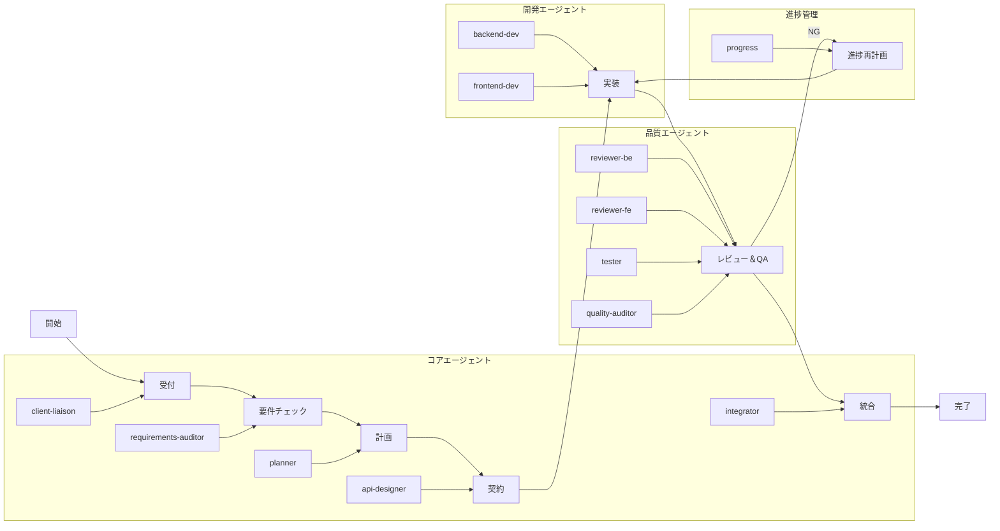

# ワークフロー実行図

## ワークフロー実行の説明

この図は、ワークフロー実行プロセスを示しています：

1. **受付**：クライアント連絡が顧客から要件を収集
2. **要件チェック**：要件監査が要件を検証し、あいまいさをチェック
3. **計画**：プランナーが開発計画とタスクの分解を作成
4. **契約**：APIデザイナーがAPI仕様（Single Source of Truth）を作成
5. **実装**：バックエンドとフロントエンドの開発者が並列で作業
6. **レビュー＆QA**：複数の品質エージェントが実装をレビューおよびテスト
7. **統合**：インテグレーターがすべてのコンポーネントを組み合わせて最終検証を実行
8. **進捗再計画**：ステージが失敗した場合（NG）、進捗エージェントが再計画提案を作成

ワークフローは、適切な場所で順次および並列実行の両方をサポートし、自動エラーハンドリングとフォールバックメカニズムを備えています。