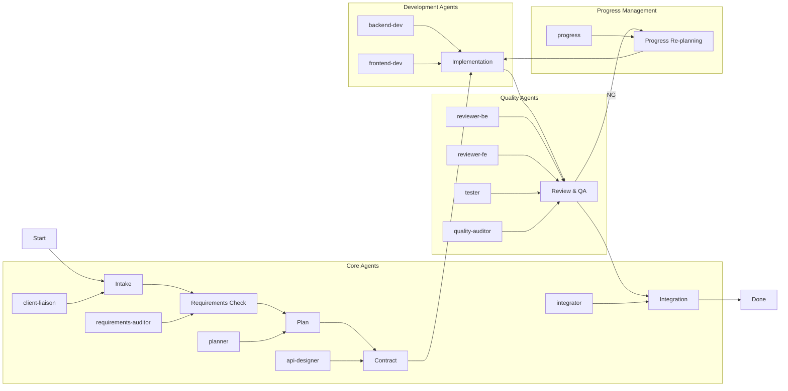

# Workflow Execution Diagram

## Workflow Execution Description

This diagram illustrates the workflow execution process:

1. **Intake**: Client liaison gathers requirements from the customer
2. **Requirements Check**: Requirements auditor validates and checks for ambiguities
3. **Plan**: Planner creates the development plan and task breakdown
4. **Contract**: API designer creates the API specification (Single Source of Truth)
5. **Implementation**: Backend and frontend developers work in parallel
6. **Review & QA**: Multiple quality agents review and test the implementation
7. **Integration**: Integrator combines all components and performs final validation
8. **Progress Re-planning**: If any stage fails (NG), the progress agent creates a re-planning proposal

The workflow supports both sequential and parallel execution where appropriate, with automatic error handling and fallback mechanisms.