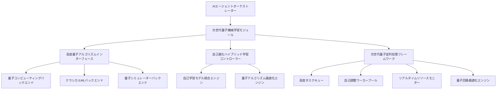

# 次世代量子AI統合の高度化設計 - 設計ドキュメント

## 概要

このドキュメントでは、量子機械学習とAIエージェントの次世代高度化統合に関する設計と実装計画を記述します。既存の量子AI統合システムをさらに進化させ、量子コンピューティング技術をAIエージェントオーケストレーションシステムに深く統合することで、複雑な最適化問題や機械学習タスクのパフォーマンスを大幅に向上させることを目指します。

## 目標

1. **量子機械学習フレームワークの高度化**: 既存の量子AI統合システムをさらに進化させ、高度な量子アルゴリズムとハイブリッド学習システムを統合
2. **パフォーマンス最適化**: 量子並列処理を活用した高速な意思決定と問題解決のさらなる高度化
3. **実用化研究**: 量子アルゴリズムの実世界での適用可能性を評価し、実用化に向けた高度化
4. **自己進化システム**: 量子AIシステムの自己学習と自己最適化機能の実装

## アーキテクチャ設計

### 1. 次世代量子機械学習モジュール

### 2. 主要コンポーネント

#### 高度量子アルゴリズムインターフェース
- 量子コンピューティングリソースとの高度インターフェース
- 高度な量子回路の定義と実行
- 結果の解釈とクラシカルシステムへの変換
- 量子エラー訂正とノイズ軽減
- 量子アルゴリズムの自己最適化

#### 次世代量子並列処理フレームワーク
- 高度な量子アルゴリズムの並列実行管理
- 自己調整タスクキューと優先度管理
- リアルタイムリソースモニタリングと負荷分散
- 動的なワーカースケーリングと自己最適化
- 量子回路の並列実行と結果統合
- 量子並列処理のパフォーマンスモニタリング

#### 自己進化ハイブリッド学習コントローラー
- 量子アルゴリズムとクラシカルアルゴリズムの高度協調制御
- タスクに応じた最適なアルゴリズムの自己選択
- パフォーマンスモニタリングと動的切り替え
- 自己学習によるアルゴリズム選択の最適化
- 量子アルゴリズムのパラメータ最適化
- ハイブリッド学習の自己進化

#### 自己学習モデル統合エンジン
- 量子モデルとクラシカルモデルの高度統合
- 自己学習によるハイブリッドモデルのトレーニングと推論
- モデルのバージョニングと管理
- 量子モデルの自己最適化
- ハイブリッドモデルのパフォーマンス評価
- 自己進化によるモデル改善

#### 量子アルゴリズム最適化エンジン
- 量子アルゴリズムのパラメータ最適化
- 量子回路の最適化と簡略化
- 量子エラー訂正とノイズ軽減
- 量子アルゴリズムの自己学習
- 量子アルゴリズムのパフォーマンス評価
- 量子アルゴリズムの自己進化

## 実装計画

### フェーズ1: 高度インフラの構築

1. **高度量子コンピューティングバックエンドの選定と統合**
   - 既存の量子コンピューティングプラットフォーム（IBM Quantum, Google Quantum AI, etc.）との高度統合
   - 高度な量子シミュレーターの統合（開発環境用）
   - 量子回路実行のための高度APIラッパーの開発
   - 量子エラー訂正とノイズ軽減機能の実装

2. **高度量子アルゴリズムインターフェースの実装**
   - 高度な量子アルゴリズム（QAOA, VQE, Grover's algorithmなど）の実装
   - 量子回路の定義と実行のための高度抽象化レイヤー
   - 結果の解釈とクラシカルデータ形式への変換
   - 量子アルゴリズムの自己最適化機能の実装

3. **次世代量子並列処理フレームワークの実装**
   - 高度な量子アルゴリズムの並列実行のための自己調整ワーカープール
   - 高度タスクキューと優先度管理システム
   - リアルタイムリソースモニタリングと負荷分散アルゴリズム
   - 動的なリソース割り当てと自己最適化機能
   - 量子回路の並列実行と結果統合機能

### フェーズ2: 自己進化ハイブリッド学習システムの開発

1. **自己進化ハイブリッド学習コントローラーの実装**
   - タスク分類とアルゴリズム選択ロジック
   - パフォーマンスメトリクスの収集と分析
   - 動的なアルゴリズム切り替え機能
   - 自己学習によるアルゴリズム選択の最適化
   - 量子アルゴリズムのパラメータ最適化

2. **自己学習モデル統合エンジンの開発**
   - 量子モデルとクラシカルモデルの高度統合フレームワーク
   - 自己学習によるハイブリッドモデルのトレーニングパイプライン
   - モデルのバージョニングと管理システム
   - 量子モデルの自己最適化機能
   - ハイブリッドモデルのパフォーマンス評価

3. **量子アルゴリズム最適化エンジンの開発**
   - 量子アルゴリズムのパラメータ最適化
   - 量子回路の最適化と簡略化
   - 量子エラー訂正とノイズ軽減
   - 量子アルゴリズムの自己学習
   - 量子アルゴリズムのパフォーマンス評価

### フェーズ3: AIエージェントとの高度統合

1. **次世代量子機械学習モジュールとAIエージェントの高度統合**
   - エージェントインターフェースの高度拡張
   - 量子機械学習機能を活用した新しいエージェントタイプの開発
   - 既存エージェントの量子機能への高度アクセス
   - 自己進化エージェントの実装

2. **ワークフローの高度拡張**
   - 量子機械学習タスクの高度ワークフロー定義
   - 量子並列処理の高度ワークフロー統合
   - 高度エラーハンドリングとフォールバック機制
   - 自己進化ワークフローの実装

3. **量子並列処理の高度最適化と統合**
   - 量子並列処理フレームワークとAIエージェントの高度統合
   - タスクの優先度付けとリソース割り当ての高度最適化
   - 動的なワーカースケーリングと負荷分散の高度統合
   - パフォーマンスモニタリングと自己最適化
   - 量子並列処理の自己進化

## 技術スタック

- **量子コンピューティング**: Qiskit, Cirq, PennyLane, TensorFlow Quantum
- **機械学習**: TensorFlow Quantum, PyTorch, JAX
- **統合フレームワーク**: Python, gRPC, REST API
- **エージェントフレームワーク**: 既存のAIエージェントオーケストレーションシステム
- **自己進化フレームワーク**: 自動機械学習（AutoML）フレームワーク
- **パフォーマンスモニタリング**: Prometheus, Grafana

## テストと検証

1. **ユニットテスト**: 個々のコンポーネントの機能検証
2. **統合テスト**: システム全体の統合と相互運用性の検証
3. **パフォーマンステスト**: 量子アルゴリズムのパフォーマンス評価
4. **エッジケーステスト**: エラーハンドリングとフォールバック機制の検証
5. **量子並列処理テスト**: 並列処理のパフォーマンスとスケーラビリティの検証
6. **リソース管理テスト**: リソース割り当てと負荷分散の検証
7. **自己進化テスト**: 自己進化機能の検証
8. **自己最適化テスト**: 自己最適化機能の検証

## タイムライン

- **フェーズ1**: 3-4週間
- **フェーズ2**: 4-5週間
- **フェーズ3**: 3-4週間
- **テストと検証**: 3週間

## 次のステップ

1. 高度量子コンピューティングバックエンドの選定と統合を開始
2. 高度量子アルゴリズムインターフェースの実装
3. 自己進化ハイブリッド学習コントローラーの設計と実装
4. 量子アルゴリズム最適化エンジンの開発
5. 自己学習モデル統合エンジンの開発