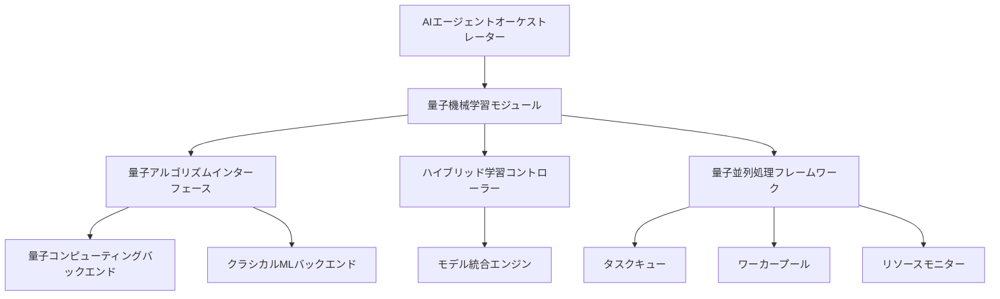

# 量子AI統合の次世代深化 - 設計ドキュメント

## 概要

このドキュメントでは、量子機械学習とAIエージェントの次世代統合に関する設計と実装計画を記述します。量子コンピューティング技術をAIエージェントオーケストレーションシステムに統合することで、複雑な最適化問題や機械学習タスクのパフォーマンスを大幅に向上させることを目指します。

## 目標

1. **量子機械学習フレームワークの統合**: 既存のAIエージェントシステムに量子機械学習アルゴリズムを統合
2. **パフォーマンス最適化**: 量子並列処理を活用した高速な意思決定と問題解決
3. **実用化研究**: 量子アルゴリズムの実世界での適用可能性を評価

## アーキテクチャ設計

### 1. 量子機械学習モジュール

### 2. 主要コンポーネント

#### 量子アルゴリズムインターフェース
- 量子コンピューティングリソースとのインターフェース
- 量子回路の定義と実行
- 結果の解釈とクラシカルシステムへの変換

#### 量子並列処理フレームワーク
- 量子アルゴリズムの並列実行管理
- タスクキューと優先度管理
- リソースモニタリングと負荷分散
- 動的なワーカースケーリング

#### ハイブリッド学習コントローラー
- 量子アルゴリズムとクラシカルアルゴリズムの協調制御
- タスクに応じた最適なアルゴリズムの選択
- パフォーマンスモニタリングと動的切り替え

#### モデル統合エンジン
- 量子モデルとクラシカルモデルの統合
- ハイブリッドモデルのトレーニングと推論
- モデルのバージョニングと管理

## 実装計画

### フェーズ1: 基礎インフラの構築

1. **量子コンピューティングバックエンドの選定と統合**
   - 既存の量子コンピューティングプラットフォーム（IBM Quantum, Google Quantum AI, etc.）との接続
   - 量子シミュレーターの統合（開発環境用）
   - 量子回路実行のためのAPIラッパーの開発

2. **量子アルゴリズムインターフェースの実装**
   - 基本的な量子アルゴリズム（QAOA, VQE, Grover's algorithmなど）の実装
   - 量子回路の定義と実行のための抽象化レイヤー
   - 結果の解釈とクラシカルデータ形式への変換

3. **量子並列処理フレームワークの実装**
   - 量子アルゴリズムの並列実行のためのワーカープール
   - タスクキューと優先度管理システム
   - リソースモニタリングと負荷分散アルゴリズム
   - 動的なリソース割り当てとスケーリング機能

### フェーズ2: ハイブリッド学習システムの開発

1. **ハイブリッド学習コントローラーの実装**
   - タスク分類とアルゴリズム選択ロジック
   - パフォーマンスメトリクスの収集と分析
   - 動的なアルゴリズム切り替え機能

2. **モデル統合エンジンの開発**
   - 量子モデルとクラシカルモデルの統合フレームワーク
   - ハイブリッドモデルのトレーニングパイプライン
   - モデルのバージョニングと管理システム

### フェーズ3: AIエージェントとの統合

1. **量子機械学習モジュールとAIエージェントの統合**
   - エージェントインターフェースの拡張
   - 量子機械学習機能を活用した新しいエージェントタイプの開発
   - 既存エージェントの量子機能へのアクセス

2. **ワークフローの拡張**
   - 量子機械学習タスクのワークフロー定義
   - 量子並列処理のワークフロー統合
   - エラーハンドリングとフォールバック機制

3. **量子並列処理の最適化と統合**
   - 量子並列処理フレームワークとAIエージェントの統合
   - タスクの優先度付けとリソース割り当ての最適化
   - 動的なワーカースケーリングと負荷分散の統合
   - パフォーマンスモニタリングと自動最適化

## 技術スタック

- **量子コンピューティング**: Qiskit, Cirq, PennyLane
- **機械学習**: TensorFlow Quantum, PyTorch
- **統合フレームワーク**: Python, gRPC
- **エージェントフレームワーク**: 既存のAIエージェントオーケストレーションシステム

## テストと検証

1. **ユニットテスト**: 個々のコンポーネントの機能検証
2. **統合テスト**: システム全体の統合と相互運用性の検証
3. **パフォーマンステスト**: 量子アルゴリズムのパフォーマンス評価
4. **エッジケーステスト**: エラーハンドリングとフォールバック機制の検証
5. **量子並列処理テスト**: 並列処理のパフォーマンスとスケーラビリティの検証
6. **リソース管理テスト**: リソース割り当てと負荷分散の検証

## タイムライン

- **フェーズ1**: 2-3週間
- **フェーズ2**: 3-4週間
- **フェーズ3**: 2-3週間
- **テストと検証**: 2週間

## 次のステップ

1. 量子コンピューティングバックエンドの選定と統合を開始
2. 基本的な量子アルゴリズムインターフェースの実装
3. ハイブリッド学習コントローラーの設計と実装
