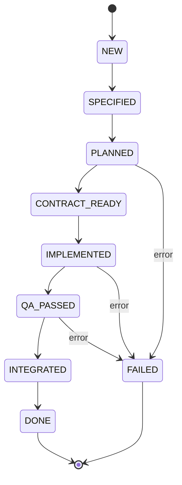

# State Machine Documentation

このドキュメントは **OpenHands Agent Delegation** の状態遷移モデルを記述します。

## 状態一覧

| 状態 | 説明 |
|------|------|
| `NEW` | ワークフローが作成された直後の初期状態 |
| `SPECIFIED` | 要件が確定し、プランが作成された状態 |
| `PLANNED` | 計画が確定し、実装フェーズへ移行可能 |
| `CONTRACT_READY` | API 契約（OpenAPI / JSONSchema）が生成された状態 |
| `IMPLEMENTED` | 各エージェントが実装を完了した状態 |
| `QA_PASSED` | 品質ゲート（テスト・レビュー）を通過した状態 |
| `INTEGRATED` | 成果物が統合され、最終確認が完了した状態 |
| `DONE` | プロジェクトが完了し、クライアントに納品された状態 |
| `FAILED` | 任意のステージで致命的エラーが発生し、プロセスが中断された状態 |

## 遷移図 (Mermaid)

## 説明

1. **NEW → SPECIFIED**: `client-liaison` が顧客要求を受け取り、要件を抽出します。
2. **SPECIFIED → PLANNED**: `planner` が工程とタスクを定義し、スケジュールを作成します。
3. **PLANNED → CONTRACT_READY**: `api-designer` が OpenAPI 仕様を生成し、契約を確定します。
4. **CONTRACT_READY → IMPLEMENTED**: `backend-dev` と `frontend-dev` が並列で実装を行います。
5. **IMPLEMENTED → QA_PASSED**: `reviewer-be`, `reviewer-fe`, `tester` がレビュー・テストを実施します。
6. **QA_PASSED → INTEGRATED**: `integrator` が成果物を統合し、最終チェックを行います。
7. **INTEGRATED → DONE**: `progress` が最終報告を作成し、クライアントへ納品します。
8. 任意のステージで **NG** が返された場合は `progress` が再計画を提案し、必要に応じて **FAILED** へ遷移します。

この状態遷移は **workflow-schema.yaml** の `stages` 定義と連動し、各ステージの `gate` 設定で合否判定が行われます。

